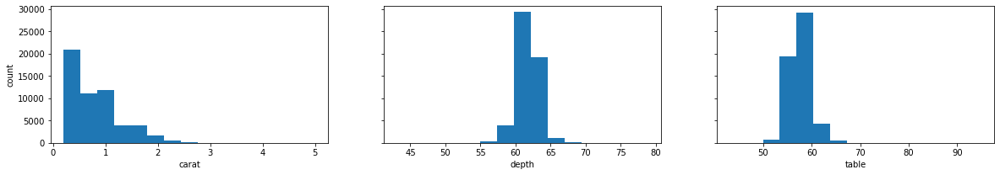
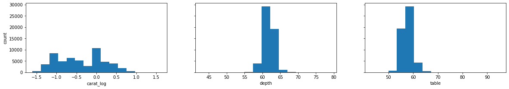

# Interpreting Transformed Regression Coefficients

## Introduction

When transformations are applied to the features in a linear regression, this has implications for the interpretation of the model coefficients.

## Objectives

You will be able to:

* Interpret the linear regression coefficient for a feature that has been log transformed
* Interpret the linear regression coefficient for a target that has been log transformed
* Interpret the linear regression coefficient for a feature that has been one-hot encoded

## Recall: Regression Coefficients in StatsModels

Before interpreting coefficients from transformed data, let's review a more basic StatsModels result.

### Baseline Data Preparation

Here we'll use the [Diamonds](https://www.kaggle.com/datasets/shivam2503/diamonds) dataset from Kaggle:


```python
import pandas as pd
df = pd.read_csv("diamonds.csv", index_col=0)
df
```


<div>
<style scoped>
    .dataframe tbody tr th:only-of-type {
        vertical-align: middle;
    }

    .dataframe tbody tr th {
        vertical-align: top;
    }

    .dataframe thead th {
        text-align: right;
    }
</style>
<table border="1" class="dataframe">
  <thead>
    <tr style="text-align: right;">
      <th></th>
      <th>carat</th>
      <th>cut</th>
      <th>color</th>
      <th>clarity</th>
      <th>depth</th>
      <th>table</th>
      <th>price</th>
      <th>x</th>
      <th>y</th>
      <th>z</th>
    </tr>
  </thead>
  <tbody>
    <tr>
      <th>1</th>
      <td>0.23</td>
      <td>Ideal</td>
      <td>E</td>
      <td>SI2</td>
      <td>61.5</td>
      <td>55.0</td>
      <td>326</td>
      <td>3.95</td>
      <td>3.98</td>
      <td>2.43</td>
    </tr>
    <tr>
      <th>2</th>
      <td>0.21</td>
      <td>Premium</td>
      <td>E</td>
      <td>SI1</td>
      <td>59.8</td>
      <td>61.0</td>
      <td>326</td>
      <td>3.89</td>
      <td>3.84</td>
      <td>2.31</td>
    </tr>
    <tr>
      <th>3</th>
      <td>0.23</td>
      <td>Good</td>
      <td>E</td>
      <td>VS1</td>
      <td>56.9</td>
      <td>65.0</td>
      <td>327</td>
      <td>4.05</td>
      <td>4.07</td>
      <td>2.31</td>
    </tr>
    <tr>
      <th>4</th>
      <td>0.29</td>
      <td>Premium</td>
      <td>I</td>
      <td>VS2</td>
      <td>62.4</td>
      <td>58.0</td>
      <td>334</td>
      <td>4.20</td>
      <td>4.23</td>
      <td>2.63</td>
    </tr>
    <tr>
      <th>5</th>
      <td>0.31</td>
      <td>Good</td>
      <td>J</td>
      <td>SI2</td>
      <td>63.3</td>
      <td>58.0</td>
      <td>335</td>
      <td>4.34</td>
      <td>4.35</td>
      <td>2.75</td>
    </tr>
    <tr>
      <th>...</th>
      <td>...</td>
      <td>...</td>
      <td>...</td>
      <td>...</td>
      <td>...</td>
      <td>...</td>
      <td>...</td>
      <td>...</td>
      <td>...</td>
      <td>...</td>
    </tr>
    <tr>
      <th>53936</th>
      <td>0.72</td>
      <td>Ideal</td>
      <td>D</td>
      <td>SI1</td>
      <td>60.8</td>
      <td>57.0</td>
      <td>2757</td>
      <td>5.75</td>
      <td>5.76</td>
      <td>3.50</td>
    </tr>
    <tr>
      <th>53937</th>
      <td>0.72</td>
      <td>Good</td>
      <td>D</td>
      <td>SI1</td>
      <td>63.1</td>
      <td>55.0</td>
      <td>2757</td>
      <td>5.69</td>
      <td>5.75</td>
      <td>3.61</td>
    </tr>
    <tr>
      <th>53938</th>
      <td>0.70</td>
      <td>Very Good</td>
      <td>D</td>
      <td>SI1</td>
      <td>62.8</td>
      <td>60.0</td>
      <td>2757</td>
      <td>5.66</td>
      <td>5.68</td>
      <td>3.56</td>
    </tr>
    <tr>
      <th>53939</th>
      <td>0.86</td>
      <td>Premium</td>
      <td>H</td>
      <td>SI2</td>
      <td>61.0</td>
      <td>58.0</td>
      <td>2757</td>
      <td>6.15</td>
      <td>6.12</td>
      <td>3.74</td>
    </tr>
    <tr>
      <th>53940</th>
      <td>0.75</td>
      <td>Ideal</td>
      <td>D</td>
      <td>SI2</td>
      <td>62.2</td>
      <td>55.0</td>
      <td>2757</td>
      <td>5.83</td>
      <td>5.87</td>
      <td>3.64</td>
    </tr>
  </tbody>
</table>
<p>53940 rows × 10 columns</p>
</div>


According to the documentation, the `depth` and `table` features are computed based on `x`, `y`, and `z`, so let's drop those in addition to selecting only numeric features for now.


```python
y = df["price"]
X = df.drop(["price", "x", "y", "z"], axis=1).select_dtypes("number")
```


```python
X.describe()
```


<div>
<style scoped>
    .dataframe tbody tr th:only-of-type {
        vertical-align: middle;
    }

    .dataframe tbody tr th {
        vertical-align: top;
    }

    .dataframe thead th {
        text-align: right;
    }
</style>
<table border="1" class="dataframe">
  <thead>
    <tr style="text-align: right;">
      <th></th>
      <th>carat</th>
      <th>depth</th>
      <th>table</th>
    </tr>
  </thead>
  <tbody>
    <tr>
      <th>count</th>
      <td>53940.000000</td>
      <td>53940.000000</td>
      <td>53940.000000</td>
    </tr>
    <tr>
      <th>mean</th>
      <td>0.797940</td>
      <td>61.749405</td>
      <td>57.457184</td>
    </tr>
    <tr>
      <th>std</th>
      <td>0.474011</td>
      <td>1.432621</td>
      <td>2.234491</td>
    </tr>
    <tr>
      <th>min</th>
      <td>0.200000</td>
      <td>43.000000</td>
      <td>43.000000</td>
    </tr>
    <tr>
      <th>25%</th>
      <td>0.400000</td>
      <td>61.000000</td>
      <td>56.000000</td>
    </tr>
    <tr>
      <th>50%</th>
      <td>0.700000</td>
      <td>61.800000</td>
      <td>57.000000</td>
    </tr>
    <tr>
      <th>75%</th>
      <td>1.040000</td>
      <td>62.500000</td>
      <td>59.000000</td>
    </tr>
    <tr>
      <th>max</th>
      <td>5.010000</td>
      <td>79.000000</td>
      <td>95.000000</td>
    </tr>
  </tbody>
</table>
</div>


### Building a Baseline Regression Model

The task is to predict the price of the diamond based on its other features. Let's build a multiple regression model with StatsModels!


```python
import statsmodels.api as sm

# instantiate a model using un-transformed numeric features
baseline_model = sm.OLS(y, sm.add_constant(X))

# fit the model
baseline_results = baseline_model.fit()

# display the results
print(baseline_results.summary())
```

                                OLS Regression Results                            
    ==============================================================================
    Dep. Variable:                  price   R-squared:                       0.854
    Model:                            OLS   Adj. R-squared:                  0.854
    Method:                 Least Squares   F-statistic:                 1.049e+05
    Date:                Thu, 31 Mar 2022   Prob (F-statistic):               0.00
    Time:                        13:07:05   Log-Likelihood:            -4.7194e+05
    No. Observations:               53940   AIC:                         9.439e+05
    Df Residuals:                   53936   BIC:                         9.439e+05
    Df Model:                           3                                         
    Covariance Type:            nonrobust                                         
    ==============================================================================
                     coef    std err          t      P>|t|      [0.025      0.975]
    ------------------------------------------------------------------------------
    const         1.3e+04    390.918     33.264      0.000    1.22e+04    1.38e+04
    carat       7858.7705     14.151    555.356      0.000    7831.035    7886.506
    depth       -151.2363      4.820    -31.378      0.000    -160.683    -141.789
    table       -104.4728      3.141    -33.259      0.000    -110.630     -98.316
    ==============================================================================
    Omnibus:                    14107.737   Durbin-Watson:                   1.015
    Prob(Omnibus):                  0.000   Jarque-Bera (JB):           154392.067
    Skew:                           0.945   Prob(JB):                         0.00
    Kurtosis:                      11.070   Cond. No.                     5.02e+03
    ==============================================================================
    
    Notes:
    [1] Standard Errors assume that the covariance matrix of the errors is correctly specified.
    [2] The condition number is large, 5.02e+03. This might indicate that there are
    strong multicollinearity or other numerical problems.


### Interpreting the Coefficients of a Baseline Regression Model

There is a lot of information in that result, but let's focus specifically on the `coef` column. That same data can be accessed using the `params` attribute of the results object:


```python
baseline_results.params
```


    const    13003.440524
    carat     7858.770510
    depth     -151.236347
    table     -104.472780
    dtype: float64


Here is how we can interpret those values. You can do this with looping code or just by looking at the values:


```python
for key, value in baseline_results.params.iteritems():
    if key == "const":
        print(f"The intercept (when all other features are 0) is: ${value:,.2f}")
    else:
        if value < 0:
            direction = "decreases"
        else:
            direction = "increases"
        print(f"For each increase of 1 in {key}, the price {direction} by ${abs(value):,.2f}")
```

    The intercept (when all other features are 0) is: $13,003.44
    For each increase of 1 in carat, the price increases by $7,858.77
    For each increase of 1 in depth, the price decreases by $151.24
    For each increase of 1 in table, the price decreases by $104.47


## Regression Coefficients with Log Transformed Features

### Log Transformation of Features

One reason to log transform a feature is to try to make the feature more normally distributed. Let's investigate their current distributions:


```python
import matplotlib.pyplot as plt

def plot_feature_distributions(X):
    """
    Helper function that plots the distribution of each feature in X
    """
    fig, ax = plt.subplots(ncols=X.shape[1], figsize=(20, 3), sharey=True)
    
    ax[0].set_ylabel("count")

    for index, feature in enumerate(X):
        ax[index].hist(X[feature], bins=15)
        ax[index].set_xlabel(feature)
        
plot_feature_distributions(X)
```


    

    


Based on this, let's apply a log transformation to the `carat_points` feature, which is quite positively skewed:


```python
import numpy as np

# Create a copy of X to apply transformations on
X_log_transformed = X.copy()
# Create a new column carat_log that contains log transformed data
X_log_transformed["carat_log"] = np.log(X_log_transformed["carat"])
# Drop original carat column
X_log_transformed.drop("carat", axis=1, inplace=True)
# Reset column order for easier comparison
X_log_transformed = X_log_transformed[["carat_log", "depth", "table"]]

X_log_transformed
```


<div>
<style scoped>
    .dataframe tbody tr th:only-of-type {
        vertical-align: middle;
    }

    .dataframe tbody tr th {
        vertical-align: top;
    }

    .dataframe thead th {
        text-align: right;
    }
</style>
<table border="1" class="dataframe">
  <thead>
    <tr style="text-align: right;">
      <th></th>
      <th>carat_log</th>
      <th>depth</th>
      <th>table</th>
    </tr>
  </thead>
  <tbody>
    <tr>
      <th>1</th>
      <td>-1.469676</td>
      <td>61.5</td>
      <td>55.0</td>
    </tr>
    <tr>
      <th>2</th>
      <td>-1.560648</td>
      <td>59.8</td>
      <td>61.0</td>
    </tr>
    <tr>
      <th>3</th>
      <td>-1.469676</td>
      <td>56.9</td>
      <td>65.0</td>
    </tr>
    <tr>
      <th>4</th>
      <td>-1.237874</td>
      <td>62.4</td>
      <td>58.0</td>
    </tr>
    <tr>
      <th>5</th>
      <td>-1.171183</td>
      <td>63.3</td>
      <td>58.0</td>
    </tr>
    <tr>
      <th>...</th>
      <td>...</td>
      <td>...</td>
      <td>...</td>
    </tr>
    <tr>
      <th>53936</th>
      <td>-0.328504</td>
      <td>60.8</td>
      <td>57.0</td>
    </tr>
    <tr>
      <th>53937</th>
      <td>-0.328504</td>
      <td>63.1</td>
      <td>55.0</td>
    </tr>
    <tr>
      <th>53938</th>
      <td>-0.356675</td>
      <td>62.8</td>
      <td>60.0</td>
    </tr>
    <tr>
      <th>53939</th>
      <td>-0.150823</td>
      <td>61.0</td>
      <td>58.0</td>
    </tr>
    <tr>
      <th>53940</th>
      <td>-0.287682</td>
      <td>62.2</td>
      <td>55.0</td>
    </tr>
  </tbody>
</table>
<p>53940 rows × 3 columns</p>
</div>


```python
plot_feature_distributions(X_log_transformed)
```


    

    


That looks a bit better. `carat_points_log` is still not quite normally distributed, but it's less skewed.

### Building a Model with Log Transformed Features

Let's try fitting another model, this time using `X_log_transformed`:


```python
# instantiate a model using X with log transformed feature
log_feature_model = sm.OLS(y, sm.add_constant(X_log_transformed))

# fit the model
log_feature_results = log_feature_model.fit()

# display the results
print(log_feature_results.summary())
```

                                OLS Regression Results                            
    ==============================================================================
    Dep. Variable:                  price   R-squared:                       0.736
    Model:                            OLS   Adj. R-squared:                  0.736
    Method:                 Least Squares   F-statistic:                 5.010e+04
    Date:                Thu, 31 Mar 2022   Prob (F-statistic):               0.00
    Time:                        13:07:08   Log-Likelihood:            -4.8787e+05
    No. Observations:               53940   AIC:                         9.757e+05
    Df Residuals:                   53936   BIC:                         9.758e+05
    Df Model:                           3                                         
    Covariance Type:            nonrobust                                         
    ==============================================================================
                     coef    std err          t      P>|t|      [0.025      0.975]
    ------------------------------------------------------------------------------
    const       2.108e+04    529.246     39.837      0.000       2e+04    2.21e+04
    carat_log   5919.0486     15.447    383.189      0.000    5888.773    5949.324
    depth       -148.4972      6.479    -22.921      0.000    -161.195    -135.799
    table        -98.2168      4.230    -23.218      0.000    -106.508     -89.925
    ==============================================================================
    Omnibus:                    12714.958   Durbin-Watson:                   0.255
    Prob(Omnibus):                  0.000   Jarque-Bera (JB):            31229.917
    Skew:                           1.304   Prob(JB):                         0.00
    Kurtosis:                       5.663   Cond. No.                     5.06e+03
    ==============================================================================
    
    Notes:
    [1] Standard Errors assume that the covariance matrix of the errors is correctly specified.
    [2] The condition number is large, 5.06e+03. This might indicate that there are
    strong multicollinearity or other numerical problems.


### Interpreting the Coefficients of a Model with Log Transformed Features

It's not actually clear that our log transformation actually improved the model performance overall, but let's go ahead and interpret the coefficients.


```python
log_feature_results.params
```


    const        21083.504922
    carat_log     5919.048615
    depth         -148.497224
    table          -98.216810
    dtype: float64


#### Interpreting Non-Transformed Features

For `const`, `depth`, and `table`, the interpretations are the same as without the log transformation. They are not the same _numbers_ because this is a different model, but the interpretation is the same. Here is the interpretation written out in text form this time:

* The intercept (when all other features are 0) is -&#36;21,083.50
* For each increase of 1 in `depth`, the `price` decreases by &#36;148.50
* For each increase of 1 in `table`, the `price` decreases by &#36;98.22

#### Why Our Previous Approach Won't Work for Log Transformed Features

For `carat_log`, the interpretation is a bit more complicated. It is technically correct to say *for each increase of 1 in the natural log of `carat`, the `price` increases by &#36;5,919.05* but that is not particularly meaningful. Even if you have the domain understanding to understand what "1 `carat`" means, it's unlikely that you can formulate a meaningful mental model of what "an increase of 1 in the natural log of `carat`" means.

#### Inverting the Log Transformation

The inverse of a logarithm is an exponent. So let's use the `exp` function from NumPy to transform our coefficient:


```python
# Extract the coefficient from the model results
carat_log_coef = log_feature_results.params["carat_log"]
carat_log_coef
```


    5919.0486153264865


```python
np.exp([carat_log_coef])
```

    <ipython-input-13-b36eff925cd2>:1: RuntimeWarning: overflow encountered in exp
      np.exp([carat_log_coef])


    array([inf])


```python

```
